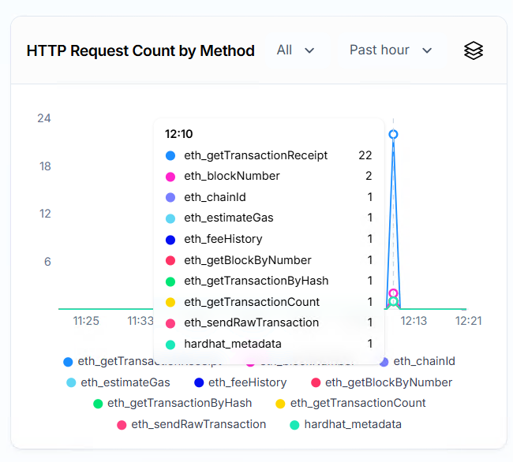

# 03. Deploy to Testnet and call to Alchemy


## Relevant JSON-RPC APIs

__Summary__

| Purpose           | RPC Method Used under the hood            | Who Provides It       |
|-------------------|------------------------                   |---------------------- |
| Deploy contract   | `eth_sendRawTransaction` and URL provider | Alchemy               |
| Read balance      | `eth_getBalance`                          | Alchemy / ethers.js   |
| Call view funcs   | `eth_call`                                | Alchemy               |
| Get logs/events   | `eth_getLogs`                             | Alchemy               |


## Steps

__Step 1. Install deps__

```sh
cd my-app/contracts
pnpm add -D dotenv
```

__Step 2. .env setup__

```sh
ALCHEMY_SEPOLIA_URL=https://eth-sepolia.g.alchemy.com/v2/YOUR_API_KEY
DEPLOYER_SEPOLIA_PRIVATE_KEY=0xYOUR_PRIVATE_KEY
```

__Step 3. hardhat.config.js__

```sh
require("@nomicfoundation/hardhat-toolbox");
require("dotenv").config();

module.exports = {
  solidity: "0.8.28",
  networks: {
    sepolia: {
      url: process.env.ALCHEMY_SEPOLIA_URL,
      accounts: [process.env.DEPLOYER_SEPOLIA_PRIVATE_KEY],
    },
  },
};
```

__Step 4. Deploy contract__

We are using Alchemy RPC host provider to deploy the contract.

```sh
npx hardhat run scripts/deploy.js --network sepolia

HelloWorld smartcontract deployed. Address:  0x857bc1DdfFd1f3272AAf41D08E73954F6d278882
```

__HTTP Request Count by Method__

If the contract is deployed, next are the requests made to Alchemy.




__step 5. Update React application__

Changes:
- Deployment-ready structure
- Balance fetch from Alchemy
- Smart contract interaction (read/write)

```ts
import { useEffect, useState } from 'react';
import { ethers } from 'ethers';
import contractData from './contract-address.json';

// Type declaration for window.ethereum
declare global {
  interface Window {
    ethereum?: ethers.Eip1193Provider;
  }
}

const CONTRACT_ADDRESS = contractData.address;

const ABI = [
  "function message() view returns (string)",
  "function setMessage(string _newMessage)",
  "event MessageUpdated(string)"
];

function App() {
  const [message, setMessage] = useState('');
  const [newMessage, setNewMessage] = useState('');
  const [status, setStatus] = useState('');
  const [balance, setBalance] = useState<string | null>(null);
  const [userBalance, setUserBalance] = useState<string | null>(null);
  const [userAddress, setUserAddress] = useState<string | null>(null);

  useEffect(() => {
    const readMessage = async () => {
      if (!window.ethereum) {
        alert("Please install MetaMask.");
        return;
      }

      try {
        const provider = new ethers.BrowserProvider(window.ethereum as ethers.Eip1193Provider);
        const signer = await provider.getSigner();
        const contract = new ethers.Contract(CONTRACT_ADDRESS, ABI, signer);
        const msg = await contract.message();
        setMessage(msg);

        contract.on("MessageUpdated", (newValue: string) => {
          setMessage(newValue);
        });

      } catch (error) {
        console.error("Read error:", error);
      }
    };

    readMessage();

    return () => {
      if (window.ethereum) {
        try {
          const provider = new ethers.BrowserProvider(window.ethereum as ethers.Eip1193Provider);
          provider.getSigner().then(signer => {
            const contract = new ethers.Contract(CONTRACT_ADDRESS, ABI, signer);
            contract.removeAllListeners("MessageUpdated");
          });
        } catch {
          // ignore
        }
      }
    };
  }, []);

  const updateMessage = async () => {
    if (!window.ethereum) {
      alert("Please install MetaMask.");
      return;
    }

    try {
      const provider = new ethers.BrowserProvider(window.ethereum as ethers.Eip1193Provider);
      const signer = await provider.getSigner();
      const contract = new ethers.Contract(CONTRACT_ADDRESS, ABI, signer);
      const tx = await contract.setMessage(newMessage);
      setStatus("⏳ Waiting for confirmation...");
      await tx.wait();
      setStatus("✅ Message updated!");
    } catch (error) {
      console.error("Update error:", error);
      setStatus("❌ Error updating message");
    }
  };

  // Note: This will always return 0 ETH unless the contract receives ETH directly.
  const fetchBalance = async () => {
    try {
      const alchemyProvider = new ethers.JsonRpcProvider(import.meta.env.VITE_ALCHEMY_SEPOLIA_URL);
      const balanceWei = await alchemyProvider.getBalance(CONTRACT_ADDRESS);
      const balanceEth = ethers.formatEther(balanceWei);
      setBalance(balanceEth);
    } catch (err) {
      console.error("Error fetching contract balance:", err);
    }
  };

  const fetchUserBalance = async () => {
    if (!window.ethereum) return;
    try {
      const provider = new ethers.BrowserProvider(window.ethereum as ethers.Eip1193Provider);
      const signer = await provider.getSigner();
      const address = await signer.getAddress();
      const balanceWei = await provider.getBalance(address);
      const balanceEth = ethers.formatEther(balanceWei);
      setUserAddress(address);
      setUserBalance(balanceEth);
    } catch (err) {
      console.error("Error fetching user balance:", err);
    }
  };

  return (
    <div style={{ padding: 20 }}>
      <h1>📨 HelloWorld Smart Contract</h1>
      <p><strong>Current message:</strong> {message}</p>
      <input
        value={newMessage}
        onChange={e => setNewMessage(e.target.value)}
        placeholder="Type new message"
      />
      <button onClick={updateMessage} style={{ marginLeft: 10 }}>
        Update
      </button>
      <p>{status}</p>

      <hr />

      <h3>🔐 Connected Account</h3>
      {userAddress && <p><strong>Address:</strong> {userAddress}</p>}
      {userBalance && <p><strong>Balance:</strong> {userBalance} ETH</p>}
      <button onClick={fetchUserBalance}>Refresh My Balance</button>

      <hr />

      <h3>📦 Contract Info</h3>
      {balance !== null && (
        <p><strong>Contract Balance:</strong> {balance} ETH</p>
      )}
      <button onClick={fetchBalance}>Get Contract Balance</button>
      <p style={{ fontSize: '0.9em', color: '#666' }}>
        (Note: This HelloWorld contract is not payable and will always have 0 ETH unless funded externally.)
      </p>
    </div>
  );
}

export default App;
```


__Step 6. Deploy and run__

```sh
pnpm dev
```

__Step 7. Connect your MetaMask to Sepolia__

Once configured, interact with the React App.

